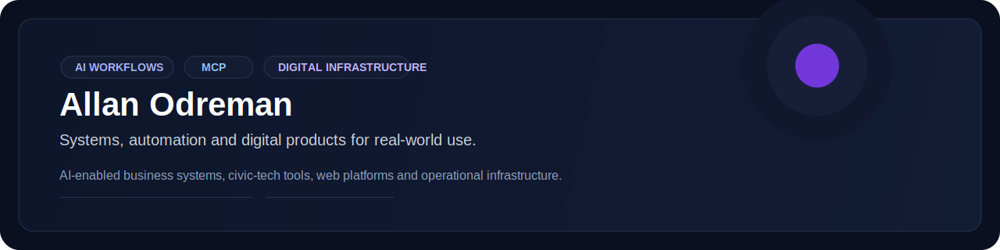

<div align="center">

<picture>
  
</picture>

[](https://www.edgemarketing.art)

[](https://github.com/mrallanodreman?tab=followers)

<br>


</div>

---

I build **AI-enabled business systems and civic-tech tools**, from MCP integrations to deployed web infrastructure.

My work connects software with real operations: AI-assisted workflows, web platforms, APIs, communications tools and the infrastructure needed to operate them.

> I do not build technology for the slide deck. I build it to solve the problem.

<div align="center">
  
</div>

## What I build

| Focus | What that means in practice |
| --- | --- |
|  **AI + automation** | Agents, tool-enabled workflows and MCP servers connected to real services. |
|  **Business systems** | Integrations across CRM, WhatsApp, ERP, payments and internal operations. |
|  **Digital products** | Web platforms and focused applications designed around a measurable need. |
|  **Civic technology** | Tools that organize public information and help important stories remain visible. |
|  **Infrastructure** | APIs, deployments, routing, monitoring and the less glamorous work that makes products reliable. |

## Selected work

> Three tracks define the portfolio right now: product, intelligence and civic infrastructure.

<div align="center">
  
</div>

<table>
<tr>
<td width="50%" valign="top">

<strong><a href="https://github.com/mrallanodreman/AllMusic2.0"> AllMusic 2.0</a></strong>

<br>

Native Linux desktop app connected to the AllMusic platform for fast search, playback and download workflows.

<br><br>


</td>
<td width="50%" valign="top">

<strong> NeuroMarkets</strong>

<br>

Private flagship focused on market intelligence, automated signal workflows and trading-oriented product systems.

<br><br>


</td>
</tr>
<tr>
<td colspan="2" valign="top">

<strong><a href="https://github.com/mrallanodreman/expediente-venezuela"> Expediente Venezuela</a></strong>

<br>

Civic research platform for timelines, evidence organization and structured public-interest investigation.

<br><br>


</td>
</tr>
</table>

<div align="center">
  
</div>

## Working stack

```text
Languages       Python · JavaScript · TypeScript · C++ · HTML/CSS
AI systems      MCP · tool calling · agents · workflow automation
Backend         Node.js · Express · FastAPI · REST APIs · webhooks
Platforms       GitHub · Railway · Cloudflare · Linux · Docker
Integrations    GoHighLevel · WhatsApp · ERP · Stripe · Brevo
Operations      DNS · reverse proxies · monitoring · deployment automation
```

## Currently working on

### ANCAR MCP ecosystem

> Private operational stack where CRM, ERP, webhook logic and AI-assisted communication work as one system.

<div align="center">
  
  
  
  
</div>

<table>
<tr>
<td width="50%" valign="top">

<strong> ANCAR MCP</strong>

<br>

Main MCP layer for agency operations, joining GoHighLevel, MBA3 ERP and AI-assisted sales workflows in one execution environment.

<br><br>


</td>
<td width="50%" valign="top">

<strong> INGCO</strong>

<br>

Webhook and operational flows for client interactions, lead capture and connected execution inside the ANCAR stack.

<br><br>


</td>
</tr>
<tr>
<td width="50%" valign="top">

<strong> Novicompu</strong>

<br>

Active work on CRM, ERP and sales-agent integration so commercial actions do not live apart from the operating system.

<br><br>


</td>
<td width="50%" valign="top">

<strong> Rectima</strong>

<br>

Service and location-aware workflows connected to webhook infrastructure, customer communication and field-ready logic.

<br><br>


</td>
</tr>
</table>

<div align="center">
  
</div>

---

<div align="center">

### Build useful things. Connect them well. Keep them running.

**Construir cosas útiles. Conectarlas bien. Mantenerlas funcionando.**

[Start a conversation](https://www.edgemarketing.art) · [Explore my repositories](https://github.com/mrallanodreman?tab=repositories)

</div>
